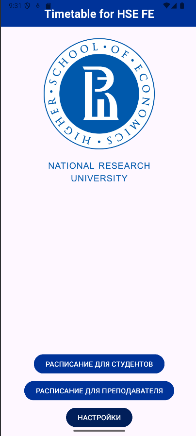
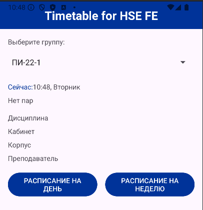
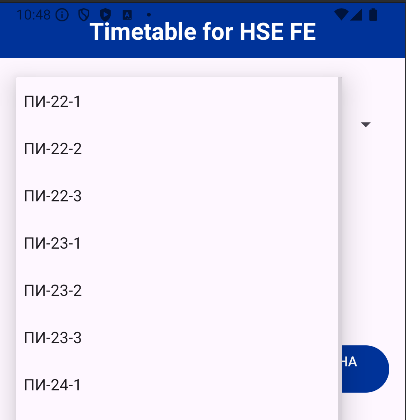
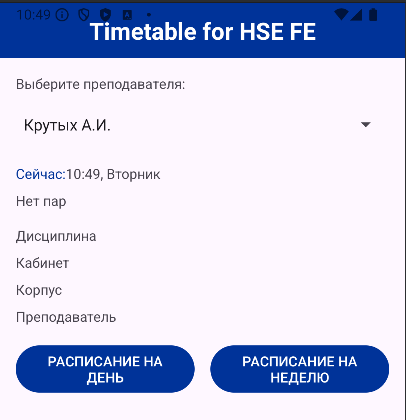
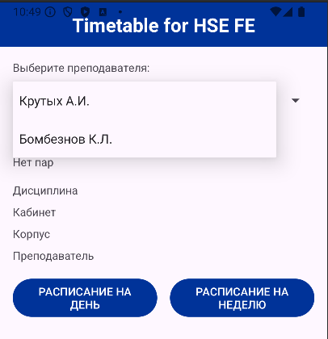

### Установка APK:
```cmd
adb install app/build/outputs/apk/debug/app-debug.apk
adb shell am start -n "org.hse.android/.MainActivity"
```


### Общий экран


### Интерфейс настроек


### Интерфейс расписания для студента



### Интерфейс расписания для преподавателя



### Показ расписания
